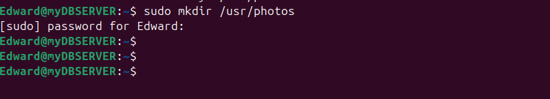
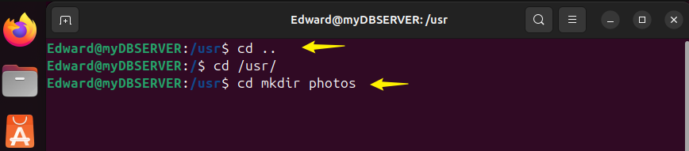
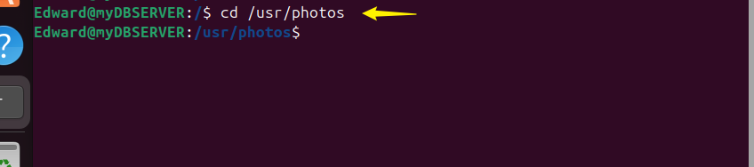
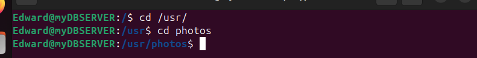
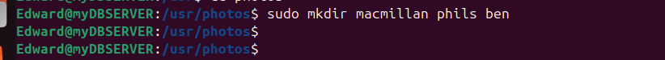
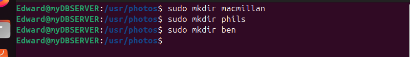
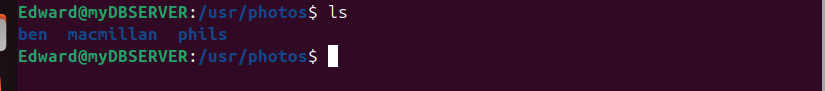
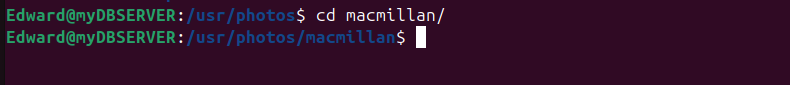
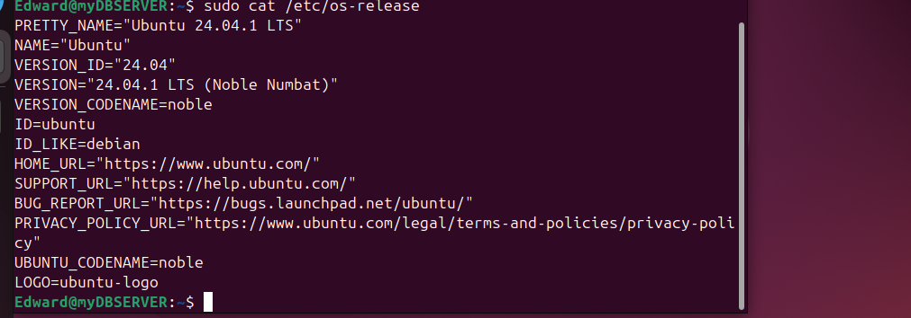

# Linux Fundamentals

## Basic Linux Commands.

LINUX COMMAND,DEEP DIVE.

**What is Linux Command**

A Linux command is a directive that instructs the Linux operating system to perform a specific task. Commands are entered into the terminal or command-line interface (CLI) and can perform a variety of functions, from basic file manipulation to complex system administration.

The general syntax of a linux command is as follows.

    CommandName [option(s)] [parameter(s)]

Here's a quick breakdown of each part:

- **CommandName**: The name of the command you want to run. For example, `ls`, `cd`, or `grep`.

- **[option(s)]**: These modify the behavior of the command. Options are usually preceded by a dash (`-`) or double dash (`--`). For example, in `ls -l`, `-l` is an option that tells `ls` to list files in a long format.

- **[parameter(s)]**: These are the arguments or targets of the command. For example, in `cd /home/user`, `/home/user` is a parameter that specifies the directory you want to change to.

**Manipulating Files and directories on Linux**

Th `sudo` command

The `sudo` command stands for "superuser do." It allows a permitted user to execute a command as the superuser (root) or another user, as specified by the security policy. It's commonly used for administrative tasks that require higher privileges, like installing software or modifying system configuration files.

Using `sudo` is important because it allows a user to execute commands with superuser (root) privileges, which are necessary for performing administrative tasks that affect the entire system. Here are a few reasons to use `sudo`:

`Security`: It limits the number of people who have direct access to the root account, reducing the risk of accidental or malicious changes.

`Least Privilege`: Users can be granted specific administrative rights without giving them full access to the root account, adhering to the principle of least privilege.

How `sudo` works.

When you precede a command with sudo,Linux ask you for a password.Once you answer it correctly,you can run command as if you were the system superuser for a short period (Usually 15min).This means you wont need to enter your password for each command within the framework.

**Creating a folder with `sudo`**

Sometimes, you need superuser privileges to create a folder in certain locations on your system.

1.Open your terminal and connect to your linux server using SSH.

2 Try creating a folder in a restricted location,for example,lets try to create a folder `suxti` in the `/root` directory, which is reserved for the root user.

    mkdir /root/suxti

3 Observe the failure. You will likely encounter a permission denied error like this.

    mkdir: cannot create directory ‘/root/suxti’: Permission denied
This error occurs because regular users do not have the neccessary permissions to create directories / root.

4 Use sudo to successfully create the folder.

     sudo mkdir /root/suxti

**Press Enter** : Because you now included the `sudo` in the command.It executes successfully without error.In some cases,you may be prompted to provide a password.

**Verify the folders creation**: You can check the folders existing by listing the contents of `/root` using the `ls` command. It should include the newly created folder in the output of your screen. You may need to use sudo to view the contents of this directory:

    sudo ls /root
**Note**: Using sudo gives you significant over your system,includng the ability to change or delete cruscial system files. So its wise to use it carefully and only when neccessary.

`pwd command`

Use the `pwd` command to find the path of your current working directory.Simply entering `pwd` will return the full current path- a path of all the directories thats starts with a forward slash `/`

The `pwd` command uses the following syntax.

    pwd
    /Users/dareyio/Desktop

**The Linux Directory Structure**


The Linux directory structure is organized in a hierarchical manner, starting with the root directory, which is represented by a forward slash (/). Here are some of the key directories and their purposes:

- **/**: The root directory, the top level of the directory hierarchy.
- **/bin**: Contains essential binary executables, like common shell commands (e.g., ls, cp).
- **/boot**: Contains the files needed to boot the system, including the Linux kernel.
- **/dev**: Contains device files, which represent hardware and virtual devices.
- **/etc**: Contains system-wide configuration files and shell scripts.
- **/home**: Contains the home directories for user accounts.
- **/lib**: Contains shared libraries needed by system programs and kernel modules.
- **/media**: Temporary mount points for removable media like CDs, DVDs, and USB drives.
- **/mnt**: Temporary mount points for filesystems.
- **/opt**: Contains optional software and third-party applications.
- **/proc**: Contains virtual files that provide information about the system and processes.
- **/root**: The home directory for the root user.
- **/run**: Contains runtime data for applications and services since the last boot.
- **/sbin**: Contains system binaries that are typically used by the root user for system administration tasks.
- **/srv**: Contains data for services provided by the system (e.g., web server files).
- **/tmp**: Contains temporary files that may be deleted after a reboot.
- **/usr**: Contains user binaries, libraries, documentation, and source code.
- **/var**: Contains variable data files, such as logs, databases, and email spool files.

`cd command`

The `cd` command, short for "change directory," is used in Unix-like operating systems such as Linux to change the current working directory. 

Here’s a quick summary:
- **Syntax**: `cd [directory]`
- **Examples**:
  - `cd /path/to/directory`: Changes to the specified directory.
  - `cd ..`: Moves up one directory level (to the parent directory).
  - `cd ~`: Changes to the user's home directory.
  - `cd -`: Switches to the previous working directory.

This command is crucial for navigating the file system in the terminal.

for example, you want to navigate to the root filesystem on your server.Remember the root filesystem on linux is like the C: drive on windows.It is a starting point of folders and it is represented by `/` on linux. To go to the root filesystem,simply type:

    sudo cd /

To confirm you are there,use the `pwd` command to check where you are.

To list the files and directories on the system,simply type `sudo ls -l`

    ❯ sudo ls -l
    total 10
    drwxrwxr-x  119 root  admin  3808  5 Aug 10:50 Applications
    drwxr-xr-x   75 root  wheel  2400 27 Feb 14:24 Library
    drwxr-xr-x@  10 root  wheel   320  9 Feb 09:39 System
    drwxr-xr-x    7 root  admin   224 27 Feb 14:23 Users
    drwxr-xr-x    3 root  wheel    96  4 Aug 16:07 Volumes
    drwxr-xr-x@  39 root  wheel  1248  9 Feb 09:39 bin
    drwxrwxr-t    2 root  admin    64 18 Oct  2021 cores
    dr-xr-xr-x    4 root  wheel  4997  4 Aug 16:05 dev
    lrwxr-xr-x@   1 root  wheel    11  9 Feb 09:39 etc -> private/etc
    lrwxr-xr-x    1 root  wheel    25  4 Aug 16:06 home -> /System/Volumes/Data/home
    drwxr-xr-x    3 root  wheel    96  6 Dec  2021 opt
    drwxr-xr-x    6 root  wheel   192  4 Aug 16:06 private
    drwxr-xr-x@  64 root  wheel  2048  9 Feb 09:39 sbin
    lrwxr-xr-x@   1 root  wheel    11  9 Feb 09:39 tmp -> private/tmp
    drwxr-xr-x@  11 root  wheel   352  9 Feb 09:39 usr
    lrwxr-xr-x@   1 root  wheel    11  9 Feb 09:39 var -> private/var

if you want to navigate to any of the directories in the output, let say the `usr`, then we can use the `cd` command to enter that directory.

    sudo cd /usr

Notice that the `usr` has a `/` prefix. On linux, navigation starts from the root.


TAKS 1.

* Create a directory called `photos` inside the `/usr` directory

      sudo mkdir /usr/photos

    

    Alternatively


        cd /usr
        sudo mkdir photos

    

* Navigate into the `photos` directory.

        cd /usr/photos
  

  Alternatively

        cd /usr/
        cd photos

   
* Create 3 more random directories inside the `photos` directory.

        sudo mkdir macmillan phils ben

   

   Alternatively

        sudo mkdir macmillan
        sudo mkdir phils
        sudo mkdir ben

   

* Show the newly created directories on the terminal.

       ls
   

* Navigate into one of them.

        cd macmillan/

  

* show the full path where you currently are on the screen.

        pwd

  


**LINUX COMMANDS**


`ls command`

  The `ls` command in Linux is used to list the contents of a directory. It's one of the most commonly used commands to see what's inside a directory.

  Here’s a quick summary:
- **Syntax**: `ls [options] [directory]`
- **Examples**:
  - `ls`: Lists the contents of the current directory.
  - `ls /path/to/directory`: Lists the contents of the specified directory.
  - `ls -l`: Lists the contents in long format, showing detailed information about each file and directory.
  - `ls -a`: Lists all files, including hidden files (those starting with a dot).
  - `ls -lh`: Lists contents with human-readable file sizes.
  - `ls -R` lists all the files in the subdirectories.
  - `ls -lh` shows the file sizes in easily readable        formats,such as MB, GB, and TB.


The `ls` command has many options that can be used to customize the output. It’s a handy command for navigating and managing files in the terminal. 

`cat command`

The `cat` command in Linux is used to concatenate and display the contents of files. It’s a simple but powerful command for viewing file content quickly.

Here’s a quick summary:
- **Syntax**: `cat [options] [file]`
- **Examples**:
  - `cat filename.txt`: Displays the contents of `filename.txt` in the terminal.
  - `cat file1.txt file2.txt`: Concatenates and displays the contents of both `file1.txt` and `file2.txt`.
  - `cat -n filename.txt`: Displays the contents of `filename.txt` with line numbers.
  - `cat filename.txt > newfile.txt`: Redirects the contents of `filename.txt` to `newfile.txt`, effectively copying it.

The `cat` command is particularly useful for viewing small files, combining multiple files, and creating new files from the contents of existing ones.

Example

    sudo cat /etc/os-release

   


`cp command`

The `cp` command in Linux is used to copy files and directories from one location to another.

Here’s a quick summary:
- **Syntax**: `cp [options] source destination`
- **Examples**:
  - `cp file1.txt /path/to/destination/`: Copies `file1.txt` to the specified directory.
  - `cp file1.txt file2.txt /path/to/destination/`: Copies multiple files to the specified directory.
  - `cp -r /source/directory /path/to/destination/`: Recursively copies an entire directory and its contents to the destination.
  - `cp -i file1.txt /path/to/destination/`: Prompts for confirmation before overwriting an existing file.
  - `cp -R /home/username/Documents /home/username/Documents_backup`:To Copy the entire directory,pass the -R flag before typing the source directory,followed by the destination directory.

The `cp` command is essential for file management tasks, allowing you to create copies of files and directories easily. 

`mv command`

The `mv` command in Linux is used to move or rename files and directories.

Here’s a quick summary:
- **Syntax**: `mv [options] source destination`
- **Examples**:
  - `mv file1.txt /path/to/destination/`: Moves `file1.txt` to the specified directory.
  - `mv file1.txt newname.txt`: Renames `file1.txt` to `newname.txt`.
  - `mv /source/directory /path/to/destination/`: Moves an entire directory and its contents to the destination.
  - `mv -i file1.txt /path/to/destination/`: Prompts for confirmation before overwriting an existing file.

The `mv` command is essential for file management tasks, allowing you to move or rename files and directories easily.

`rm command`

The `rm` command is a powerful tool in Unix-based systems, like Linux and macOS, used to **remove files or directories**.

Here's a quick overview:

- To remove a file:
  ```bash
  rm filename
  ```

- To remove multiple files:
  ```bash
  rm file1 file2 file3
  ```

- To remove a directory and its contents recursively:
  ```bash
  rm -r directoryname
  ```

- For a safer approach to prevent accidental deletions, you can use the `-i` option, which prompts for confirmation before each removal:
  ```bash
  rm -i filename
  ```

Caution is key with the `rm` command because once a file is deleted, it's not easily recoverable. Use it wisely!

`touch command`

The `touch` command in Unix-based systems is used to create new, empty files or update the **timestamp** of existing files.

Here's a quick rundown:

- To create a new file or update the timestamp of an existing file:
  ```bash
  touch filename
  ```

- To create multiple files at once:
  ```bash
  touch file1 file2 file3
  ```

If the specified files don't already exist, `touch` will create them. If they do exist, it will update their access and modification times to the current time without altering the content.

`find command`

The `find` command is incredibly useful in Unix-based systems for searching files and directories based on various criteria.

Here's a quick summary:

- To search for a file by name in the current directory and its subdirectories:
  ```bash
  find . -name "filename"
  ```

- To find files by type (e.g., directories):
  ```bash
  find . -type d -name "directoryname"
  ```

- To search files modified in the last 7 days:
  ```bash
  find . -mtime -7
  ```

- To find files larger than a specific size (e.g., 1 MB):
  ```bash
  find . -size +1M
  ```

- To search with multiple criteria, you can combine options:
  ```bash
  find . -name "*.txt" -size +1M
  ```

The `find` command is incredibly powerful, allowing you to search by name, type, size, modification time, permissions, and more. Just be mindful of the criteria you use to avoid overly broad searches!


